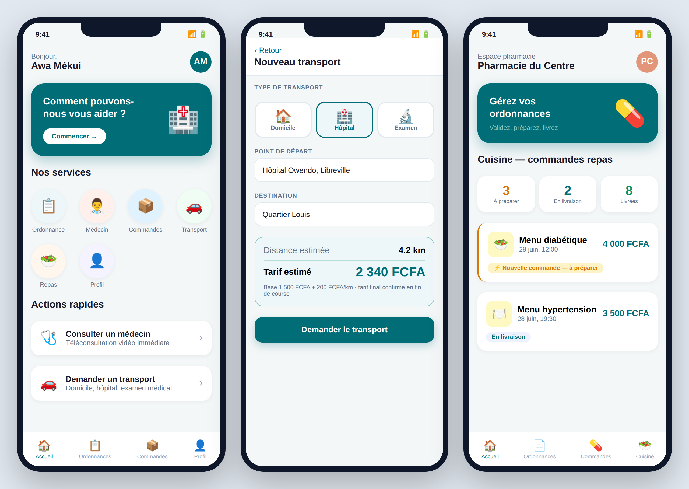
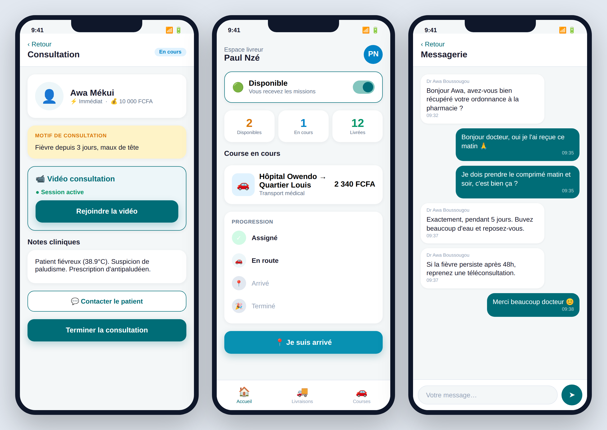
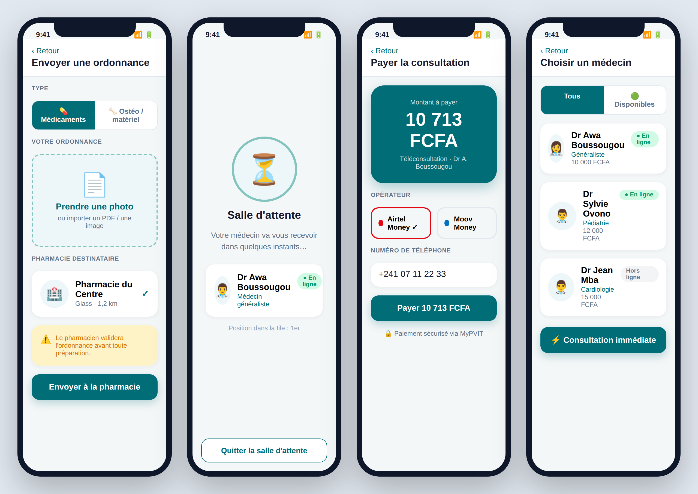
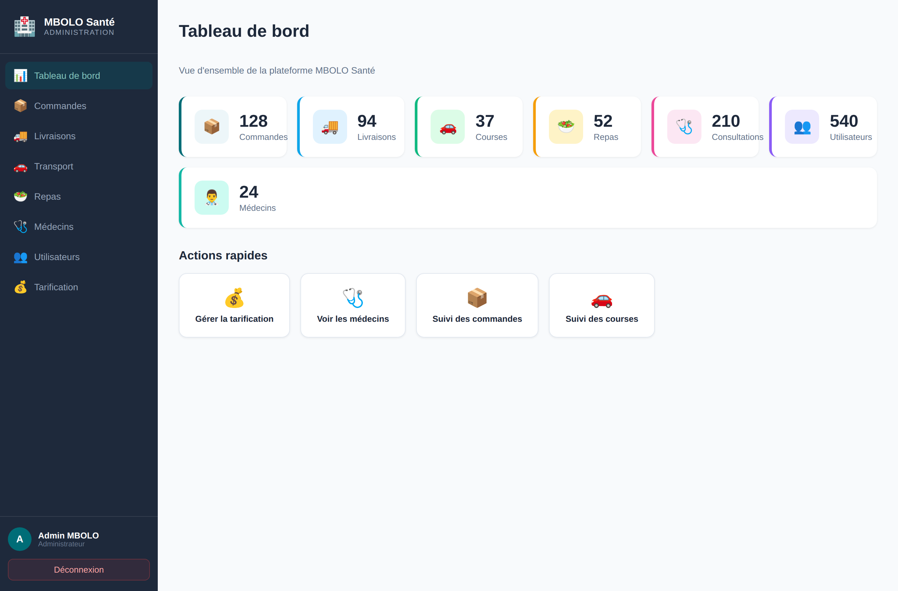

# Captures d'écran — MBOLO Santé

> Charte unifiée **teal `#006D77`** sur les deux plateformes. Les captures du
> dashboard sont des rendus réels (Vite build + Chromium, données de démo) ; les
> écrans mobiles sont des maquettes fidèles à la charte (l'app réelle est
> React Native / Expo).

## 📱 Application mobile

Vue d'ensemble patient + pro :

| Écran | Aperçu |
|-------|--------|
| Accueil patient | [`mobile/patient-accueil.png`](mobile/patient-accueil.png) |
| Demande de transport (estimation live) | [`mobile/patient-transport.png`](mobile/patient-transport.png) |
| Envoyer une ordonnance | [`mobile/patient-ordonnance.png`](mobile/patient-ordonnance.png) |
| Choisir un médecin | [`mobile/patient-medecins.png`](mobile/patient-medecins.png) |
| Salle d'attente vidéo | [`mobile/patient-salle-attente.png`](mobile/patient-salle-attente.png) |
| Paiement Mobile Money | [`mobile/patient-paiement.png`](mobile/patient-paiement.png) |
| Espace pharmacie / cuisine | [`mobile/pharmacie-cuisine.png`](mobile/pharmacie-cuisine.png) |
| Consultation médecin (vidéo) | [`mobile/medecin-consultation.png`](mobile/medecin-consultation.png) |
| Espace coursier (suivi de course) | [`mobile/coursier-course.png`](mobile/coursier-course.png) |
| Messagerie patient ↔ médecin | [`mobile/chat.png`](mobile/chat.png) |

## 🖥️ Dashboard web (administration)

| Page | Aperçu |
|------|--------|
| Connexion (OTP) | [`web/01-login.png`](web/01-login.png) |
| Tableau de bord | [`web/02-dashboard.png`](web/02-dashboard.png) |
| Commandes | [`web/03-orders.png`](web/03-orders.png) |
| Tarification | [`web/04-pricing.png`](web/04-pricing.png) |
| Livraisons | [`web/05-deliveries.png`](web/05-deliveries.png) |
| Transport | [`web/06-rides.png`](web/06-rides.png) |
| Repas | [`web/07-meals.png`](web/07-meals.png) |
| Médecins | [`web/08-doctors.png`](web/08-doctors.png) |
| Utilisateurs | [`web/09-users.png`](web/09-users.png) |

